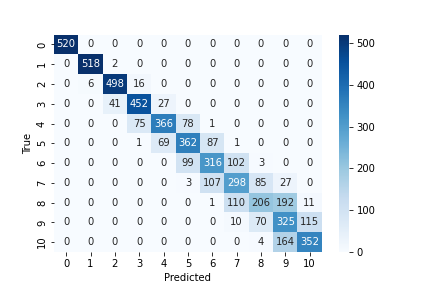
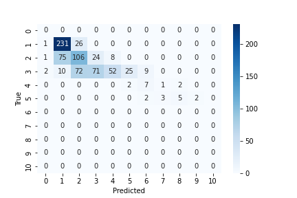

# ASR Speaker Estimation

## Number of Speaker Estimation in Real-Life Conversations
Number of speaker estimation from single channel speech audio is an ASR task that is often used
as starting point for other related task, such as speech diarization, but could also be used for audiosurveillance. In this work the robustness and generalizability of CountNet, a neural network for
number of speaker estimation, trained on an artificially generated dataset was evaluated. The
model was trained on a dataset generated from single speaker audio book recordings and tested
on audio recordings of realistic conversations, which were manually labelled. Results show that
model performance does generalize as well to these realistic datasets, and the number of
simultaneous speakers are often overestimated, possibly as a result of reverberance,
environmental characteristics, and speaking style.

| Original Dataset             | Real-life Dataset  |
:-------------------------:|:-------------------------:
 |  